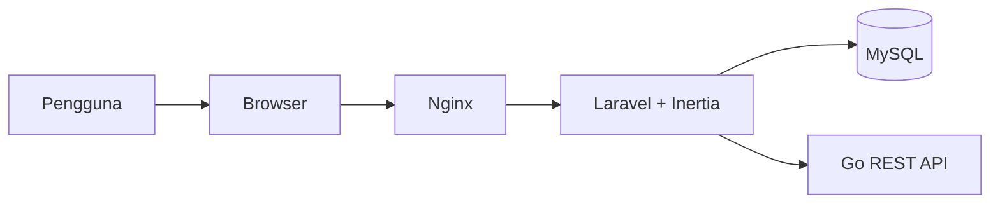
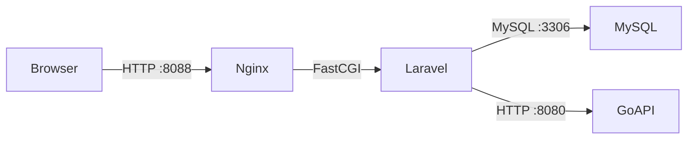
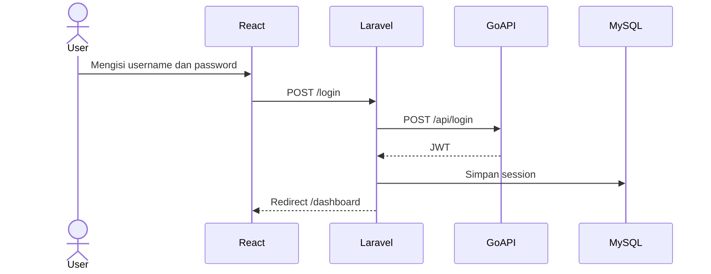
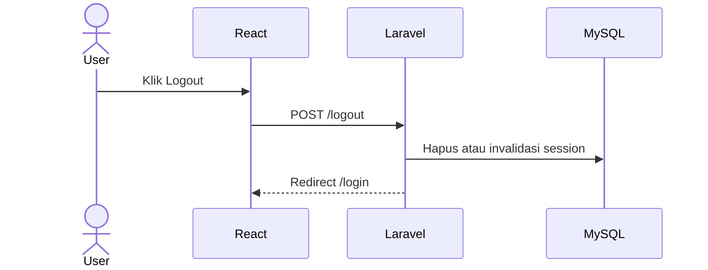
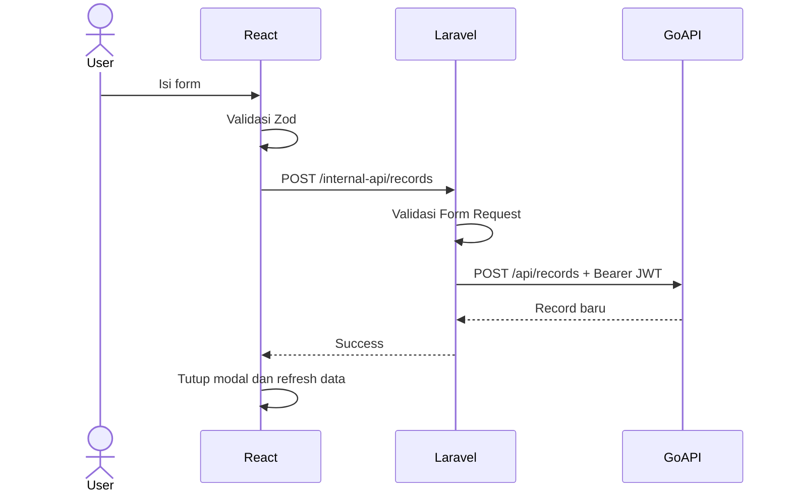
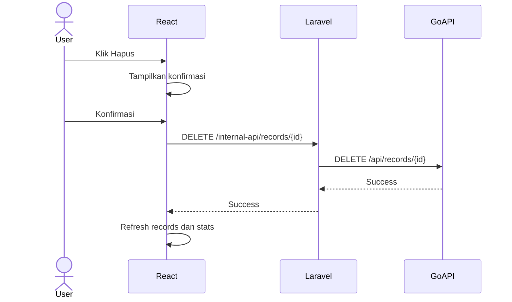

# Product Requirements Document (PRD)
# Full-Stack Analytics Dashboard

**Nama Produk:** Full-Stack Analytics Dashboard  
**Versi Dokumen:** 1.0  
**Status:** Siap Implementasi  
**Tanggal:** 5 Agustus 2026  
**Platform:** Web responsif  
**Bahasa Antarmuka:** Indonesia  
**Sumber Kebutuhan:** Dokumen tugas teknis Dashboard Full-Stack dan Go REST API  
**Backend API:** `bektigalan/test`  
**Docker Hub:** https://hub.docker.com/r/bektigalan/test  

---

## 1. Ringkasan Eksekutif

Full-Stack Analytics Dashboard adalah aplikasi web responsif untuk melakukan autentikasi, menampilkan dan mengelola data record, memvisualisasikan pendapatan dan distribusi pengguna, serta memantau statistik sistem dari Go REST API yang telah tersedia.

Aplikasi dibangun menggunakan:

- Laravel sebagai application server, routing, session management, Backend for Frontend (BFF), validasi tambahan, dan integrasi ke Go REST API.
- Inertia.js sebagai penghubung Laravel dengan React tanpa membangun REST API frontend terpisah.
- React dan TypeScript sebagai lapisan antarmuka pengguna.
- MySQL sebagai penyimpanan session Laravel, audit log, dan preferensi dashboard.
- Tailwind CSS sebagai utility-first CSS framework.
- shadcn/ui sebagai basis komponen UI.
- Docker atau Podman sebagai mekanisme containerization dan deployment.

Backend Go tetap menjadi sumber data utama untuk autentikasi JWT, records, seed data, dan statistik sistem. Laravel tidak menggantikan Go API. Laravel bertindak sebagai perantara yang aman antara browser dan Go API.

Aplikasi harus dapat dijalankan secara lokal dan melalui container dengan proses yang terdokumentasi, stabil, serta dapat disiapkan untuk server yang tidak memiliki akses internet.

---

## 2. Latar Belakang

Go REST API yang tersedia menyediakan kemampuan berikut:

- Health check.
- Autentikasi menggunakan JWT.
- Pengambilan seluruh record.
- Pengambilan detail record.
- Penambahan record.
- Penghapusan record.
- Pembuatan seed data.
- Pengambilan statistik sistem dan database.

API belum menyediakan antarmuka visual. Pengguna memerlukan dashboard modern untuk menjalankan seluruh operasi tersebut tanpa menggunakan Swagger, curl, atau REST client secara manual.

Dashboard juga harus memberikan visualisasi yang mudah dipahami untuk:

- Total record.
- Total revenue.
- Revenue per site.
- Jumlah record per user.
- Penggunaan memori.
- Jumlah goroutine.
- Uptime backend.

---

## 3. Tujuan Produk

### 3.1 Tujuan Utama

1. Menyediakan antarmuka login yang aman dan mudah digunakan.
2. Mengintegrasikan seluruh endpoint utama Go REST API.
3. Menampilkan records dalam tabel yang mudah dicari dan digunakan.
4. Memungkinkan pengguna menambah, menghapus, dan menghasilkan data dummy.
5. Menyediakan visualisasi revenue dan user yang informatif.
6. Menampilkan statistik kesehatan sistem.
7. Menangani loading, error, sesi kedaluwarsa, dan rate limiting dengan jelas.
8. Menyediakan deployment berbasis Docker atau Podman dengan satu perintah.
9. Mendukung proses build lokal dan distribusi image ke server tanpa internet.
10. Menjaga struktur kode yang modular, mudah diuji, dan mudah dikembangkan.

### 3.2 Sasaran Keberhasilan

Produk dianggap berhasil apabila:

- Pengguna dapat login menggunakan kredensial Go API.
- Semua halaman terproteksi tidak dapat diakses tanpa sesi valid.
- Data records dan stats tampil sesuai respons Go API.
- Pengguna dapat menambah dan menghapus record.
- Pengguna dapat menghasilkan seed data.
- Grafik otomatis mengikuti perubahan data.
- Error `401`, `429`, validasi, dan network failure ditampilkan dengan benar.
- Aplikasi dapat dijalankan melalui Docker Compose atau Podman Compose.
- Dokumentasi setup lokal dan container dapat diikuti oleh developer lain.
- Tidak ada JWT yang dapat dibaca langsung oleh JavaScript browser.
- Antarmuka dapat digunakan pada desktop, tablet, dan mobile.

---

## 4. Ruang Lingkup

## 4.1 Termasuk dalam Ruang Lingkup

- Login menggunakan username dan password.
- Integrasi JWT dengan Go REST API.
- Session Laravel berbasis database.
- Protected route.
- Logout.
- Dashboard overview.
- Kartu metrik.
- Grafik revenue per site.
- Grafik jumlah record per user.
- Tabel records.
- Search berdasarkan site name atau user.
- Filter data.
- Sorting tabel.
- Client-side pagination.
- Detail payload JSON.
- Form tambah record.
- Validasi record.
- Seed data.
- Hapus record dengan konfirmasi.
- Manual refresh.
- Auto-refresh dengan interval aman.
- Health status backend.
- Loading state.
- Empty state.
- Error state.
- Toast notification.
- Responsive design.
- Dark mode opsional.
- Audit log aktivitas dashboard.
- Dockerfile.
- Docker Compose.
- Podman compatibility.
- Nginx configuration.
- Dokumentasi deployment offline.

## 4.2 Tidak Termasuk dalam Ruang Lingkup

- Registrasi pengguna baru.
- Lupa password.
- Manajemen role dan permission.
- Edit atau update record karena endpoint update tidak tersedia.
- Import records dari CSV atau Excel.
- Export laporan ke PDF.
- WebSocket.
- Multi-tenant.
- Penggantian Go API dengan Laravel API.
- Perubahan source code Go backend.
- Sistem pembayaran.
- Notifikasi email.
- Mobile application native.
- Penyimpanan ulang seluruh records Go API ke database Laravel.

Fitur di luar ruang lingkup dapat dipertimbangkan pada versi berikutnya.

---

## 5. Pemangku Kepentingan

| Pemangku Kepentingan | Kepentingan |
|---|---|
| Evaluator teknis | Menilai kelengkapan fitur, kualitas kode, UI/UX, dan deployment |
| Developer | Mengembangkan, menguji, dan memelihara aplikasi |
| Pengguna dashboard | Mengelola records dan melihat analitik |
| DevOps atau system administrator | Menjalankan aplikasi di lokal atau server |
| Product owner | Memastikan seluruh kebutuhan tugas terpenuhi |

---

## 6. Persona Pengguna

### 6.1 Dashboard Operator

**Tujuan:**

- Login ke sistem.
- Melihat kondisi data secara cepat.
- Menambahkan record baru.
- Menghapus record yang tidak diperlukan.
- Menghasilkan data dummy.
- Memeriksa statistik sistem.

**Kebutuhan:**

- Alur sederhana.
- Informasi error yang jelas.
- Tidak perlu memahami API.
- Tabel dan grafik mudah dibaca.
- Konfirmasi sebelum tindakan destruktif.

### 6.2 Developer atau Evaluator

**Tujuan:**

- Memverifikasi bahwa seluruh endpoint terintegrasi.
- Menilai arsitektur dan kualitas kode.
- Menjalankan proyek dengan cepat.
- Menguji error handling.
- Memeriksa containerization.

**Kebutuhan:**

- README yang jelas.
- Environment variable terdokumentasi.
- Struktur project modular.
- Docker Compose yang dapat digunakan.
- Test yang dapat dijalankan.

---

## 7. Teknologi

## 7.1 Teknologi Inti

| Lapisan | Teknologi | Peran |
|---|---|---|
| Application server | Laravel | Routing, session, BFF, validasi, logging, integrasi API |
| UI bridge | Inertia.js | Menghubungkan Laravel dan React |
| Frontend | React | Membangun komponen antarmuka |
| Type safety | TypeScript | Menjaga kontrak tipe dan mengurangi runtime error |
| Database | MySQL | Session, audit log, dan preferensi |
| Styling | Tailwind CSS | Styling responsif dan konsisten |
| UI components | shadcn/ui | Button, Card, Dialog, Table, Form, Toast, dan komponen lain |
| Backend sumber data | Go REST API | Autentikasi JWT, records, seed, dan stats |
| Container | Docker atau Podman | Build dan deployment |
| Web server | Nginx | Menyajikan aplikasi dan meneruskan request ke PHP-FPM |

## 7.2 Library Pendukung yang Direkomendasikan

| Library | Fungsi |
|---|---|
| Axios | Request dari React ke endpoint Laravel |
| Laravel HTTP Client | Request dari Laravel ke Go API |
| React Hook Form | Manajemen form |
| Zod | Validasi frontend |
| Recharts | Grafik revenue dan user |
| TanStack Table | Tabel, sorting, filter, dan pagination |
| Lucide React | Ikon |
| date-fns | Format tanggal |
| Sonner | Toast notification |
| Laravel Pint | Code formatting PHP |
| ESLint | Pemeriksaan kode TypeScript |
| Prettier | Format TypeScript, React, dan CSS |
| PHPUnit atau Pest | Test backend Laravel |
| Vitest | Unit test frontend |
| React Testing Library | Component test |

Library pendukung dapat disesuaikan selama fungsi dan kualitas yang sama tetap terpenuhi.

---

## 8. Keputusan Arsitektur

## 8.1 Pola Arsitektur

Aplikasi menggunakan pola **Laravel Backend for Frontend (BFF)**.

Browser tidak mengakses Go API secara langsung. Seluruh request dari React dikirimkan ke Laravel. Laravel kemudian meneruskan request ke Go API dengan JWT yang tersimpan di session server.

### Alasan

1. JWT tidak perlu disimpan di `localStorage`.
2. Token tidak dapat dibaca langsung oleh JavaScript browser.
3. Browser hanya berkomunikasi dengan satu origin.
4. Risiko CORS lebih kecil.
5. Penanganan error API dapat distandarkan.
6. Audit log dapat dicatat pada Laravel.
7. URL internal Go container tidak perlu diketahui browser.
8. Konfigurasi lokal dan container lebih konsisten.

## 8.2 Diagram Konteks



## 8.3 Diagram Container



## 8.4 Tanggung Jawab Setiap Layanan

### Nginx

- Menyajikan entry point aplikasi.
- Meneruskan PHP request ke PHP-FPM.
- Menyajikan asset hasil build.
- Menambahkan konfigurasi keamanan dasar.
- Menyediakan health endpoint aplikasi bila diperlukan.

### Laravel

- Menampilkan halaman melalui Inertia.
- Menangani login dan logout aplikasi.
- Menyimpan JWT di session.
- Meneruskan request ke Go API.
- Menstandarkan respons dan error.
- Mencatat audit log.
- Menyediakan CSRF protection.
- Menangani validasi tambahan.

### React

- Menampilkan UI.
- Mengelola state halaman.
- Mengelola form.
- Menampilkan tabel dan grafik.
- Menampilkan loading, empty, dan error state.
- Memanggil endpoint internal Laravel.

### MySQL

- Menyimpan Laravel sessions.
- Menyimpan audit logs.
- Menyimpan preferensi dashboard jika digunakan.
- Tidak menjadi sumber utama records dan stats.

### Go API

- Melakukan autentikasi credential.
- Mengeluarkan JWT.
- Menyimpan dan menyediakan records.
- Menambah dan menghapus records.
- Menghasilkan seed data.
- Menyediakan stats.

---

## 9. Asumsi dan Ketergantungan

1. Image `bektigalan/test` berjalan pada port internal `8080`.
2. Username default adalah `user`.
3. Password default adalah `pass`.
4. JWT memiliki masa berlaku 24 jam.
5. Endpoint terproteksi menggunakan header `Authorization: Bearer <token>`.
6. Rate limit adalah 10 request per detik per IP dengan burst 30.
7. Batas request body backend adalah 1 MB.
8. Bentuk pasti respons login harus diverifikasi melalui Swagger atau pengujian langsung.
9. Bentuk wrapper respons records harus diverifikasi, apakah berupa array langsung atau objek.
10. Persistensi database internal image Go harus diverifikasi.
11. Batas maksimum parameter seed belum dijelaskan dan harus mengikuti implementasi backend.
12. Laravel dan Go API berada pada jaringan container yang sama saat deployment.
13. Server deployment dapat tidak memiliki akses internet.
14. Build image dilakukan di mesin lokal atau CI yang memiliki internet sebelum image dikirim ke server offline.

---

## 10. Endpoint Go API

| Method | Endpoint | Auth | Fungsi |
|---|---|---:|---|
| `GET` | `/` | Tidak | Health check |
| `POST` | `/api/login` | Tidak | Login dan mendapatkan JWT |
| `GET` | `/swagger/` | Tidak | Dokumentasi API |
| `GET` | `/api/records` | Ya | Mengambil records |
| `GET` | `/api/records/{id}` | Ya | Mengambil detail record |
| `POST` | `/api/records` | Ya | Membuat record |
| `DELETE` | `/api/records/{id}` | Ya | Menghapus record |
| `POST` | `/api/seed` | Ya | Membuat dummy records |
| `GET` | `/api/stats` | Ya | Mengambil statistik |

---

## 11. Kontrak Data

## 11.1 Record

```ts
export interface RecordItem {
    id: number;
    site_name: string;
    revenue: number;
    user: string;
    payload: string;
    created_at: string;
}
```

Contoh:

```json
{
  "id": 1,
  "site_name": "alpha-hub.io",
  "revenue": 5432.10,
  "user": "alice_dev",
  "payload": "{\"status\":\"active\",\"region\":\"us-east-1\",\"ping_ms\":25,\"views\":12500}",
  "created_at": "2026-08-03 12:00:00"
}
```

## 11.2 Stats

```ts
export interface DashboardStats {
    total_records: number;
    total_revenue: number;
    alloc_memory_mb: number;
    sys_memory_mb: number;
    num_goroutines: number;
    uptime: string;
}
```

Contoh:

```json
{
  "total_records": 10,
  "total_revenue": 54321.50,
  "alloc_memory_mb": 4.12,
  "sys_memory_mb": 12.45,
  "num_goroutines": 8,
  "uptime": "1h 15m 30s"
}
```

## 11.3 Login Request

```ts
export interface LoginRequest {
    username: string;
    password: string;
}
```

```json
{
  "username": "user",
  "password": "pass"
}
```

## 11.4 Create Record Request

```ts
export interface CreateRecordRequest {
    site_name: string;
    revenue: number;
    user: string;
    payload: string;
}
```

## 11.5 Standard Internal Response

Laravel harus menstandarkan respons untuk React.

### Sukses

```json
{
  "success": true,
  "message": "Record berhasil ditambahkan.",
  "data": {}
}
```

### Gagal

```json
{
  "success": false,
  "message": "Data tidak dapat diproses.",
  "errors": {
    "site_name": [
      "Site name maksimal 100 karakter."
    ]
  },
  "code": "VALIDATION_ERROR"
}
```

---

## 12. Model Data MySQL

MySQL tidak menggandakan tabel records dari Go API.

## 12.1 Tabel `sessions`

Menggunakan struktur session database Laravel.

Tujuan:

- Menyimpan sesi pengguna.
- Menyimpan JWT secara server-side dalam payload session terenkripsi.
- Mendukung logout dan session expiration.

Kolom mengikuti migration session bawaan Laravel.

## 12.2 Tabel `audit_logs`

| Kolom | Tipe | Keterangan |
|---|---|---|
| `id` | BIGINT | Primary key |
| `session_id` | VARCHAR nullable | ID sesi Laravel |
| `username` | VARCHAR(50) nullable | Username Go API |
| `action` | VARCHAR(50) | Nama aktivitas |
| `entity_type` | VARCHAR(50) nullable | Jenis data |
| `entity_id` | VARCHAR nullable | ID objek terkait |
| `status` | VARCHAR(20) | success atau failed |
| `http_status` | SMALLINT nullable | HTTP status Go API |
| `metadata` | JSON nullable | Data tambahan non-sensitif |
| `ip_address` | VARCHAR(45) nullable | IP pengguna |
| `user_agent` | TEXT nullable | User agent |
| `created_at` | TIMESTAMP | Waktu aktivitas |

Contoh action:

- `login`
- `logout`
- `view_dashboard`
- `view_records`
- `create_record`
- `delete_record`
- `seed_records`
- `manual_refresh`

JWT dan password tidak boleh dicatat dalam audit log.

## 12.3 Tabel `dashboard_preferences`

Tabel ini bersifat opsional tetapi direkomendasikan.

| Kolom | Tipe | Keterangan |
|---|---|---|
| `id` | BIGINT | Primary key |
| `username` | VARCHAR(50) | Pemilik preferensi |
| `theme` | VARCHAR(20) | light, dark, atau system |
| `records_per_page` | INTEGER | Jumlah baris per halaman |
| `auto_refresh_enabled` | BOOLEAN | Status auto-refresh |
| `auto_refresh_interval` | INTEGER | Interval detik |
| `created_at` | TIMESTAMP | Waktu dibuat |
| `updated_at` | TIMESTAMP | Waktu diubah |

---

## 13. Struktur Navigasi

### Desktop

- Overview
- Records
- System Health
- Audit Activity, opsional untuk evaluator
- Logout

### Mobile

- Overview
- Records
- Menu tambahan
- Logout melalui drawer atau dropdown profil

### Route Laravel

| Route | Method | Middleware | Fungsi |
|---|---|---|---|
| `/login` | GET | guest | Menampilkan login |
| `/login` | POST | guest, throttle | Proses login |
| `/logout` | POST | auth.dashboard | Logout |
| `/dashboard` | GET | auth.dashboard | Overview |
| `/records` | GET | auth.dashboard | Halaman records |
| `/system-health` | GET | auth.dashboard | Statistik sistem |
| `/internal-api/records` | GET | auth.dashboard | Proxy list records |
| `/internal-api/records/{id}` | GET | auth.dashboard | Proxy detail record |
| `/internal-api/records` | POST | auth.dashboard | Proxy create record |
| `/internal-api/records/{id}` | DELETE | auth.dashboard | Proxy delete record |
| `/internal-api/seed` | POST | auth.dashboard | Proxy seed |
| `/internal-api/stats` | GET | auth.dashboard | Proxy stats |
| `/internal-api/health` | GET | auth.dashboard | Proxy health |

Nama route dapat disesuaikan selama tujuan dan keamanannya tetap sama.

---

## 14. Alur Autentikasi

## 14.1 Login



### Ketentuan

- Field username wajib diisi.
- Field password wajib diisi.
- Password ditampilkan sebagai input tersembunyi.
- Tersedia tombol show/hide password.
- Tombol login disabled ketika request berjalan.
- Credential tidak disimpan pada database.
- JWT tidak dikirim ke React.
- Laravel menyimpan JWT di session.
- Setelah login sukses, session ID diregenerasi.
- Setelah login gagal, tampilkan pesan umum yang informatif.
- Jangan membedakan secara berlebihan apakah username atau password salah.
- Endpoint login Laravel diberi throttle tambahan.

## 14.2 Protected Route

Middleware `auth.dashboard` harus:

1. Memastikan session Laravel tersedia.
2. Memastikan token tersedia di session.
3. Memastikan expiry token belum lewat jika expiry dapat dibaca.
4. Mengarahkan pengguna ke `/login` jika sesi tidak valid.
5. Menghapus sesi apabila Go API mengembalikan `401`.

## 14.3 Logout



### Ketentuan

- Logout menggunakan method `POST`.
- Session diinvalidasi.
- CSRF token diregenerasi.
- JWT dihapus dari session.
- Pengguna dikembalikan ke login.
- Browser back tidak boleh membuka data sensitif dari cache aplikasi.

## 14.4 Sesi Kedaluwarsa

Ketika Go API mengembalikan `401`:

- Laravel menghapus token.
- Laravel menginvalidasi session.
- React menerima error standar `SESSION_EXPIRED`.
- Pengguna diarahkan ke login.
- Tampilkan notifikasi: “Sesi Anda telah berakhir. Silakan login kembali.”

---

## 15. Fitur dan Persyaratan Fungsional

# FR-01 — Login

### Deskripsi

Pengguna dapat melakukan autentikasi menggunakan credential Go API.

### Elemen UI

- Logo atau nama aplikasi.
- Input username.
- Input password.
- Tombol show/hide password.
- Tombol login.
- Pesan error.
- Loading indicator.
- Informasi credential demo hanya ditampilkan bila diizinkan untuk lingkungan tugas.

### Acceptance Criteria

- Pengguna tidak dapat mengirim form kosong.
- Login berhasil mengarahkan pengguna ke dashboard.
- Login gagal menampilkan pesan yang jelas.
- Token tidak muncul pada local storage, session storage, URL, atau source HTML.
- Refresh browser tetap mempertahankan sesi yang valid.
- Session fixation dicegah dengan regenerasi session.
- Route dashboard tidak dapat diakses tanpa session.

---

# FR-02 — Dashboard Overview

### Deskripsi

Dashboard menampilkan ringkasan data dan statistik sistem.

### Komponen

1. Header.
2. Sidebar atau navigation bar.
3. Kartu Total Records.
4. Kartu Total Revenue.
5. Kartu Allocated Memory.
6. Kartu System Memory.
7. Grafik Revenue per Site.
8. Grafik Records per User.
9. Panel Uptime.
10. Panel Goroutines.
11. Tombol Refresh.
12. Informasi waktu sinkronisasi terakhir.
13. Backend health indicator.

### Data

- Stats dari `GET /api/stats`.
- Grafik dari agregasi `GET /api/records`.

### Acceptance Criteria

- Seluruh kartu menampilkan loading skeleton saat request.
- Nilai revenue diformat sebagai mata uang.
- Memory ditampilkan dalam MB.
- Grafik memperbarui data setelah create, delete, atau seed.
- Empty state muncul jika records kosong.
- Tombol refresh tidak dapat ditekan berulang saat request aktif.
- Error sebagian tidak menghilangkan seluruh dashboard.
- Waktu terakhir diperbarui ditampilkan.

---

# FR-03 — Kartu Statistik

### Total Records

- Sumber: `stats.total_records`.
- Format: angka integer.
- Ikon: database atau files.

### Total Revenue

- Sumber: `stats.total_revenue`.
- Format default: currency.
- Mata uang dapat menggunakan `IDR` sebagai format UI bila tidak ada mata uang dari API.
- Label harus menjelaskan bahwa revenue mengikuti unit data API.

### Allocated Memory

- Sumber: `stats.alloc_memory_mb`.
- Format maksimum dua angka desimal.

### System Memory

- Sumber: `stats.sys_memory_mb`.
- Format maksimum dua angka desimal.

### Goroutines

- Sumber: `stats.num_goroutines`.
- Format integer.

### Uptime

- Sumber: `stats.uptime`.
- Ditampilkan dalam format dari API.

---

# FR-04 — Grafik Revenue per Site

### Deskripsi

Menampilkan jumlah revenue yang dikelompokkan berdasarkan `site_name`.

### Transformasi Data

```ts
type RevenueBySite = {
    siteName: string;
    revenue: number;
};
```

Aturan:

1. Kelompokkan record berdasarkan `site_name`.
2. Jumlahkan `revenue`.
3. Urutkan dari revenue terbesar.
4. Tampilkan Top 10 pada grafik.
5. Gabungkan sisanya menjadi kategori “Lainnya” bila data terlalu banyak.
6. Tooltip menampilkan nama site dan revenue.
7. Grafik responsif terhadap ukuran container.

### Bentuk Grafik

Bar chart horizontal direkomendasikan karena nama site dapat panjang.

### Acceptance Criteria

- Nilai grafik sama dengan hasil agregasi records.
- Tooltip dapat dibaca.
- Label tidak terpotong secara tidak wajar.
- Empty state ditampilkan jika tidak ada data.
- Grafik tidak crash ketika revenue bernilai 0.

---

# FR-05 — Grafik Records per User

### Deskripsi

Menampilkan jumlah records yang dikelompokkan berdasarkan field `user`.

### Transformasi Data

```ts
type RecordsByUser = {
    user: string;
    totalRecords: number;
};
```

Aturan:

1. Kelompokkan berdasarkan user.
2. Hitung jumlah record.
3. Urutkan dari jumlah terbesar.
4. Gunakan donut chart atau bar chart.
5. Tooltip menampilkan username dan jumlah record.
6. Legend dapat discroll atau dibatasi jika user banyak.

### Acceptance Criteria

- Jumlah seluruh bagian grafik sama dengan total records yang dimuat.
- Data user kosong atau tidak valid diberi label “Unknown” hanya jika backend mengirim kondisi tersebut.
- Empty state ditampilkan jika data kosong.

---

# FR-06 — Records Table

### Deskripsi

Menampilkan records dalam tabel terstruktur.

### Kolom

- ID.
- Site Name.
- Revenue.
- User.
- Payload.
- Created At.
- Action.

### Perilaku

- Header tabel tetap terlihat bila tabel panjang pada desktop.
- Revenue diformat.
- Created At diformat menggunakan locale Indonesia.
- Payload panjang tidak ditampilkan seluruhnya.
- Payload dibuka melalui dialog detail.
- Action menggunakan dropdown atau tombol yang jelas.
- Tabel dapat discroll horizontal pada mobile.
- Tersedia card view alternatif pada mobile bila diperlukan.

### Acceptance Criteria

- Seluruh data yang diterima dapat dilihat.
- Tidak ada HTML dari payload yang dirender sebagai HTML.
- Tabel tidak rusak ketika text panjang.
- Loading skeleton ditampilkan saat request.
- Empty state memiliki tombol Seed Data atau Tambah Record.
- Error state memiliki tombol Coba Lagi.

---

# FR-07 — Search dan Filter

### Search

Search mencocokkan:

- Site name.
- User.

Search dilakukan secara client-side karena API belum menyediakan parameter search.

### Filter

Filter minimum:

- Site.
- User.
- Rentang revenue.
- Rentang tanggal, jika format tanggal dapat diparsing dengan stabil.

### Sorting

Kolom yang dapat diurutkan:

- ID.
- Site Name.
- Revenue.
- User.
- Created At.

### Debounce

Input search menggunakan debounce sekitar 250–400 ms untuk kenyamanan, tetapi tidak mengirim request ke Go API pada setiap karakter.

### Acceptance Criteria

- Search tidak case-sensitive.
- Tombol reset menghapus seluruh filter.
- Jumlah hasil ditampilkan.
- Pagination kembali ke halaman pertama setelah filter berubah.
- Filter tidak mengubah data asli.

---

# FR-08 — Pagination

Karena endpoint hanya mendokumentasikan parameter `limit` dan tidak mendokumentasikan offset atau cursor, pagination dilakukan di frontend pada data yang telah dimuat.

### Ketentuan

- Default 10 records per halaman.
- Opsi 10, 25, 50, dan 100.
- Halaman tidak boleh melebihi jumlah data.
- Setelah delete, halaman disesuaikan jika halaman terakhir menjadi kosong.
- Parameter `limit` API dapat dikonfigurasi.
- Jika backend kemudian mendukung pagination server-side, implementasi dapat dimigrasikan.

---

# FR-09 — Detail Record dan Payload

### Deskripsi

Pengguna dapat melihat detail lengkap record.

### Isi Dialog

- ID.
- Site name.
- Revenue.
- User.
- Created at.
- Payload JSON yang diformat.
- Tombol copy payload.
- Status validitas JSON.

### Format Payload

Jika payload valid:

- Parse menggunakan `JSON.parse`.
- Tampilkan pretty JSON dengan indentasi.
- Escape seluruh output.

Jika payload tidak valid dari backend:

- Tampilkan sebagai plain text.
- Tampilkan badge “Invalid JSON from API”.
- Aplikasi tidak boleh crash.

### Acceptance Criteria

- Dialog dapat ditutup dengan tombol dan keyboard.
- Payload tidak dieksekusi.
- Copy menampilkan toast sukses.
- Konten panjang dapat discroll.

---

# FR-10 — Tambah Record

### Deskripsi

Pengguna dapat membuat record melalui modal atau halaman form.

### Field

#### Site Name

- Wajib.
- String.
- Maksimal 100 karakter.
- Trim whitespace.
- Counter karakter ditampilkan.

#### Revenue

- Wajib.
- Number.
- Minimum 0.
- Maksimum 1.000.000.000.
- Tidak menerima NaN, Infinity, atau karakter non-numerik.

#### User

- Wajib.
- String.
- Maksimal 50 karakter.
- Trim whitespace.

#### Payload

- Wajib sesuai kebutuhan UI.
- Harus berupa string objek JSON valid.
- Maksimal 50 KB.
- Root JSON harus object, bukan array, string, number, boolean, atau null.
- Tersedia tombol format JSON.
- Tersedia contoh placeholder.

### Contoh Payload

```json
{
  "status": "active",
  "region": "ap-southeast-1",
  "ping_ms": 25,
  "views": 12500
}
```

Sebelum request ke Go API, payload diubah menjadi string JSON sesuai kontrak backend.

### Alur



### Acceptance Criteria

- Form tidak dapat dikirim jika invalid.
- Error per field tampil di dekat input.
- Tombol submit disabled saat request.
- Double submit dicegah.
- Setelah sukses, modal ditutup.
- Records dan stats dimuat ulang.
- Grafik ikut berubah.
- Toast sukses muncul.
- Form tidak kehilangan data jika terjadi server error.
- `401` memicu session expired.
- `429` menampilkan pesan rate limit.

---

# FR-11 — Generate Seed Data

### Deskripsi

Pengguna dapat menghasilkan data dummy melalui endpoint seed.

### UI

- Tombol “Generate Seed Data”.
- Dialog konfirmasi.
- Input count opsional.
- Default count 5.
- Batas count mengikuti perilaku backend yang diverifikasi melalui Swagger.
- Tampilkan peringatan bahwa data baru akan ditambahkan.

### Alur

1. Pengguna klik Seed Data.
2. Dialog muncul.
3. Pengguna memilih count.
4. React mengirim request ke Laravel.
5. Laravel memanggil `POST /api/seed?count=N`.
6. Setelah sukses, records dan stats diperbarui.
7. Toast menampilkan hasil.

### Acceptance Criteria

- Count harus integer positif.
- Default count adalah 5.
- Tombol disabled saat proses.
- Konfirmasi diperlukan.
- Tidak ada request berulang.
- Data dan grafik tersinkronisasi setelah sukses.

---

# FR-12 — Hapus Record

### Deskripsi

Pengguna dapat menghapus satu record.

### UI

- Tombol Delete pada kolom action.
- Alert dialog konfirmasi.
- Informasi record yang akan dihapus.
- Tombol batal.
- Tombol hapus dengan destructive style.

### Alur



### Acceptance Criteria

- Tidak ada penghapusan tanpa konfirmasi.
- ID harus integer lebih dari 0.
- Tombol tidak dapat diklik berulang.
- Setelah sukses, row hilang.
- Stats dan grafik diperbarui.
- Jika record sudah tidak ada, tampilkan pesan yang sesuai.
- Jika gagal, row tetap tampil.
- Delete dicatat pada audit log.

---

# FR-13 — Refresh Data

### Manual Refresh

- Tersedia tombol refresh pada dashboard dan records.
- Satu aksi dapat memuat ulang records dan stats.
- Tampilkan spinner.
- Tampilkan waktu sinkronisasi terakhir.

### Auto-refresh

- Default dapat dinonaktifkan atau menggunakan interval 60 detik.
- Interval minimum tidak boleh agresif.
- Auto-refresh dihentikan ketika tab tidak aktif jika memungkinkan.
- Auto-refresh tidak berjalan ketika request sebelumnya belum selesai.
- Auto-refresh tidak menampilkan toast sukses setiap kali.
- Auto-refresh gagal tidak langsung menghapus data terakhir yang valid.

### Rate Limit

Aplikasi harus menjaga jumlah request tetap jauh di bawah 10 request per detik per IP.

---

# FR-14 — Backend Health Status

### Deskripsi

Dashboard menampilkan apakah Go API dapat dijangkau.

### Status

- Healthy.
- Degraded.
- Unreachable.
- Unknown.

### Perilaku

- Health check memanggil endpoint `/`.
- Status tidak perlu dipanggil terlalu sering.
- Jika health check gagal tetapi data cache tersedia, data terakhir tetap ditampilkan.
- Tampilkan tooltip berisi waktu pemeriksaan terakhir.

---

# FR-15 — System Health

### Data

- Allocated Memory.
- System Memory.
- Number of Goroutines.
- Uptime.
- Total Records.
- Total Revenue.

### UI

- Kartu statistik.
- Progress atau indicator digunakan hanya jika ada denominator yang valid.
- Jangan menginterpretasikan memori sebagai persentase tanpa total memory yang jelas.
- Tampilkan raw metrics secara akurat.

---

# FR-16 — Audit Activity

### Deskripsi

Sistem mencatat aktivitas penting untuk debugging dan evaluasi.

### Aktivitas

- Login sukses.
- Login gagal.
- Logout.
- Create record.
- Delete record.
- Seed data.
- Manual refresh.
- Error integrasi.

### Ketentuan Keamanan

- Jangan simpan password.
- Jangan simpan JWT.
- Jangan simpan seluruh payload sensitif tanpa kebutuhan.
- Metadata harus dibatasi.
- Audit page dapat bersifat internal atau tidak ditampilkan pada MVP.

---

# FR-17 — Toast dan Notifikasi

### Jenis

- Success.
- Error.
- Warning.
- Info.

### Contoh

- “Login berhasil.”
- “Record berhasil ditambahkan.”
- “Record berhasil dihapus.”
- “5 seed record berhasil dibuat.”
- “Sesi Anda telah berakhir.”
- “Terlalu banyak permintaan. Coba beberapa saat lagi.”
- “Backend tidak dapat dihubungi.”

### Ketentuan

- Pesan harus singkat dan dapat ditindaklanjuti.
- Error field tetap ditampilkan pada form meskipun toast tersedia.
- Toast tidak boleh menumpuk tanpa batas.

---

## 16. Penanganan HTTP Status

| Status | Tindakan Laravel | Tindakan React |
|---|---|---|
| `200–299` | Teruskan data terstandar | Tampilkan hasil |
| `400` | Map validation atau bad request | Tampilkan pesan |
| `401` | Invalidate session | Redirect login |
| `403` | Teruskan forbidden | Tampilkan akses ditolak |
| `404` | Map not found | Tampilkan data tidak ditemukan |
| `408` | Map timeout | Tampilkan timeout |
| `413` | Map payload too large | Tampilkan payload terlalu besar |
| `422` | Map validation | Tampilkan error per field |
| `429` | Pertahankan retry info | Tampilkan rate limit |
| `500–599` | Log error tanpa data sensitif | Tampilkan server error |
| Network error | Return `BACKEND_UNREACHABLE` | Tampilkan backend tidak tersedia |

---

## 17. Validasi

## 17.1 Validasi Frontend

Menggunakan Zod.

```ts
import { z } from 'zod';

export const createRecordSchema = z.object({
    site_name: z
        .string()
        .trim()
        .min(1, 'Site name wajib diisi.')
        .max(100, 'Site name maksimal 100 karakter.'),

    revenue: z.coerce
        .number()
        .finite()
        .min(0, 'Revenue minimal 0.')
        .max(1_000_000_000, 'Revenue maksimal 1.000.000.000.'),

    user: z
        .string()
        .trim()
        .min(1, 'User wajib diisi.')
        .max(50, 'User maksimal 50 karakter.'),

    payload: z
        .string()
        .min(1, 'Payload wajib diisi.')
        .refine((value) => new Blob([value]).size <= 50 * 1024, {
            message: 'Payload maksimal 50 KB.',
        })
        .refine((value) => {
            try {
                const parsed = JSON.parse(value);

                return (
                    typeof parsed === 'object' &&
                    parsed !== null &&
                    !Array.isArray(parsed)
                );
            } catch {
                return false;
            }
        }, 'Payload harus berupa objek JSON yang valid.'),
});
```

## 17.2 Validasi Laravel

Laravel harus mengulang validasi karena frontend validation dapat dilewati.

Contoh rule:

```php
[
    'site_name' => ['required', 'string', 'max:100'],
    'revenue' => ['required', 'numeric', 'min:0', 'max:1000000000'],
    'user' => ['required', 'string', 'max:50'],
    'payload' => [
        'required',
        'string',
        function ($attribute, $value, $fail) {
            if (strlen($value) > 50 * 1024) {
                $fail('Payload maksimal 50 KB.');
                return;
            }

            $decoded = json_decode($value);

            if (
                json_last_error() !== JSON_ERROR_NONE ||
                !is_object($decoded)
            ) {
                $fail('Payload harus berupa objek JSON yang valid.');
            }
        },
    ],
]
```

## 17.3 Validasi Go API

Go API tetap menjadi lapisan validasi terakhir. Error dari Go API harus diteruskan dalam format aman dan mudah dipahami.

---

## 18. Spesifikasi Halaman

# 18.1 Halaman Login

### Layout

- Full-screen.
- Card login berada di tengah.
- Branding pada bagian atas.
- Deskripsi singkat.
- Form username dan password.
- Tombol login.
- Pesan error.
- Mobile friendly.

### State

- Default.
- Input error.
- Loading.
- Invalid credentials.
- Backend unavailable.
- Rate limited.

---

# 18.2 Dashboard Overview

### Layout Desktop

1. Sidebar.
2. Top bar.
3. Breadcrumb atau page title.
4. Metric cards dalam grid.
5. Revenue chart.
6. User chart.
7. System health.
8. Last updated.
9. Quick action.

### Quick Action

- Tambah Record.
- Generate Seed.
- Refresh.
- Buka Records.

### Layout Mobile

- Sidebar menjadi drawer.
- Kartu menjadi satu atau dua kolom.
- Grafik menjadi satu kolom.
- Quick action menjadi button group atau menu.
- Tabel tidak ditampilkan penuh pada overview.

---

# 18.3 Halaman Records

### Bagian

1. Page title.
2. Total data.
3. Search.
4. Filter.
5. Tombol Tambah Record.
6. Tombol Seed.
7. Tombol Refresh.
8. Table.
9. Pagination.
10. Empty atau error state.

---

# 18.4 Halaman System Health

### Bagian

- Backend health.
- Uptime.
- Goroutines.
- Memory stats.
- Total records.
- Total revenue.
- Last checked.
- Refresh.

Halaman ini dapat digabung ke dashboard pada MVP, tetapi struktur komponen harus tetap modular.

---

## 19. Design System

## 19.1 Prinsip Visual

- Modern.
- Bersih.
- Profesional.
- Data-first.
- Konsisten.
- Tidak terlalu dekoratif.
- Kontras cukup.
- Responsif.

## 19.2 Komponen shadcn/ui

- Alert.
- Alert Dialog.
- Badge.
- Button.
- Card.
- Dialog.
- Dropdown Menu.
- Form.
- Input.
- Label.
- Popover.
- Select.
- Sheet.
- Skeleton.
- Table.
- Tabs.
- Textarea.
- Tooltip.
- Sonner atau Toast.

## 19.3 Warna Status

- Success: hijau.
- Warning: amber.
- Error atau destructive: merah.
- Info: biru.
- Neutral: slate atau gray.

Warna harus menggunakan token tema, bukan hard-coded berulang.

## 19.4 Tipografi

- Gunakan font sans-serif yang mudah dibaca.
- Heading memiliki hierarchy yang jelas.
- Data numerik menggunakan tabular numbers jika tersedia.
- Payload menggunakan monospace.

## 19.5 Spacing

- Gunakan spacing scale Tailwind.
- Hindari padding dan margin acak.
- Card memiliki pola padding konsisten.
- Jarak minimum target sentuh mobile mengikuti praktik aksesibilitas.

---

## 20. Responsivitas

### Breakpoint Umum

- Mobile: `< 640px`.
- Tablet: `640px–1023px`.
- Desktop: `>= 1024px`.

### Perilaku

- Sidebar desktop berubah menjadi drawer.
- Metric card menyesuaikan jumlah kolom.
- Grafik menjadi satu kolom di mobile.
- Table menggunakan horizontal scroll atau mobile card.
- Dialog form menggunakan tinggi maksimal dan scroll.
- Tombol utama tetap mudah dijangkau.
- Search dan filter dapat ditumpuk pada mobile.

---

## 21. Aksesibilitas

Target minimum mengikuti prinsip WCAG 2.1 AA sejauh relevan.

### Ketentuan

- Semua input memiliki label.
- Semua button memiliki accessible name.
- Dialog memiliki title dan description.
- Focus trap pada dialog.
- Keyboard navigation.
- Focus state terlihat.
- Kontras warna memadai.
- Informasi tidak hanya bergantung pada warna.
- Chart memiliki text summary.
- Icon-only button memiliki `aria-label`.
- Error form dapat dibaca screen reader.
- Loading menggunakan `aria-busy` bila relevan.

---

## 22. Keamanan

## 22.1 JWT

- JWT hanya disimpan pada session Laravel.
- JWT tidak dikirim ke browser.
- JWT tidak dicatat dalam log.
- JWT dihapus saat logout atau `401`.
- Session cookie menggunakan `HttpOnly`.
- Session cookie menggunakan `Secure` di production.
- `SameSite=Lax` atau konfigurasi yang sesuai.

## 22.2 CSRF

- Seluruh form mutasi Laravel dilindungi CSRF.
- Axios menggunakan XSRF token dari Laravel.
- Logout menggunakan `POST`.

## 22.3 XSS

- React tidak menggunakan `dangerouslySetInnerHTML` untuk payload.
- Payload ditampilkan sebagai plain text.
- JSON di-escape.
- Audit metadata di-escape saat ditampilkan.

## 22.4 Input

- Validasi frontend.
- Validasi Laravel.
- Validasi Go API.
- Batasi payload.
- Batasi panjang field.
- ID harus integer positif.

## 22.5 Rate Limiting

- Laravel login memiliki throttle.
- Proxy mutation memiliki throttle wajar.
- Auto-refresh tidak agresif.
- Tombol dinonaktifkan saat request.
- `429` ditangani.

## 22.6 Header

Production Nginx direkomendasikan menggunakan:

- `X-Content-Type-Options: nosniff`.
- `X-Frame-Options: SAMEORIGIN`.
- `Referrer-Policy`.
- Content Security Policy yang kompatibel dengan asset aplikasi.
- HSTS jika HTTPS telah aktif.

## 22.7 Logging

- Password tidak dicatat.
- JWT tidak dicatat.
- Authorization header tidak dicatat.
- Error response eksternal disanitasi sebelum dikirim ke browser.

---

## 23. Performa

### Target

- Initial page dapat digunakan dalam waktu wajar pada koneksi normal.
- Interaksi search client-side terasa instan.
- Perubahan create/delete memperbarui data tanpa full-page reload.
- Chart tidak merender seluruh kategori jika terlalu banyak.
- Asset frontend di-minify dan memiliki cache header.
- Request yang sama tidak dilakukan berulang tanpa kebutuhan.

### Optimasi

- Vite production build.
- Code splitting bila diperlukan.
- Lazy load halaman non-utama.
- Memoization hasil agregasi grafik.
- Debounce search.
- Abort request lama bila request baru menggantikannya.
- Gzip atau Brotli pada Nginx jika tersedia.
- Docker multi-stage build.

---

## 24. Reliability dan Resilience

### Ketentuan

- Timeout request Laravel ke Go API.
- Retry hanya untuk request idempotent seperti GET.
- POST dan DELETE tidak di-retry otomatis tanpa kontrol.
- Data terakhir tetap tampil jika refresh berikutnya gagal.
- Partial error state diperbolehkan.
- React error boundary.
- Laravel exception handling yang konsisten.
- Container menggunakan restart policy.
- Health check container disediakan.

### Timeout Rekomendasi

- Connection timeout: 3–5 detik.
- Request timeout: 10–15 detik.
- Nilai final dapat dikonfigurasi melalui environment variable.

---

## 25. Integrasi Laravel ke Go API

## 25.1 Service Class

Direkomendasikan membuat:

```text
app/
├── Services/
│   └── GoApi/
│       ├── GoApiClient.php
│       ├── AuthService.php
│       ├── RecordService.php
│       └── StatsService.php
```

### `GoApiClient`

Tanggung jawab:

- Menentukan base URL.
- Menambahkan Bearer token.
- Menambahkan timeout.
- Mapping error.
- Sanitasi log.
- Mengembalikan data terstandar.

### Contoh Konfigurasi

```php
// config/services.php
'go_api' => [
    'base_url' => env('GO_API_BASE_URL', 'http://localhost:8080'),
    'timeout' => env('GO_API_TIMEOUT', 15),
    'connect_timeout' => env('GO_API_CONNECT_TIMEOUT', 5),
],
```

## 25.2 BFF Controllers

```text
app/Http/Controllers/
├── Auth/
│   ├── LoginController.php
│   └── LogoutController.php
├── DashboardController.php
├── RecordController.php
├── SeedController.php
├── StatsController.php
└── HealthController.php
```

## 25.3 Middleware

```text
app/Http/Middleware/
├── EnsureDashboardAuthenticated.php
└── HandleExpiredGoApiToken.php
```

---

## 26. Struktur Frontend

```text
resources/js/
├── components/
│   ├── charts/
│   │   ├── RevenueBySiteChart.tsx
│   │   └── RecordsByUserChart.tsx
│   ├── dashboard/
│   │   ├── MetricCard.tsx
│   │   ├── QuickActions.tsx
│   │   └── SystemHealthPanel.tsx
│   ├── records/
│   │   ├── RecordsTable.tsx
│   │   ├── RecordColumns.tsx
│   │   ├── CreateRecordDialog.tsx
│   │   ├── DeleteRecordDialog.tsx
│   │   ├── SeedRecordsDialog.tsx
│   │   ├── RecordPayloadDialog.tsx
│   │   └── RecordFilters.tsx
│   ├── states/
│   │   ├── EmptyState.tsx
│   │   ├── ErrorState.tsx
│   │   └── LoadingState.tsx
│   └── ui/
├── hooks/
│   ├── useDashboardData.ts
│   ├── useRecords.ts
│   ├── useStats.ts
│   └── useAutoRefresh.ts
├── layouts/
│   ├── AuthLayout.tsx
│   └── DashboardLayout.tsx
├── lib/
│   ├── api.ts
│   ├── chart-transformers.ts
│   ├── formatters.ts
│   └── utils.ts
├── pages/
│   ├── auth/
│   │   └── login.tsx
│   ├── dashboard/
│   │   └── index.tsx
│   ├── records/
│   │   └── index.tsx
│   └── system-health/
│       └── index.tsx
├── schemas/
│   ├── auth-schema.ts
│   └── record-schema.ts
└── types/
    ├── api.ts
    ├── auth.ts
    ├── record.ts
    └── stats.ts
```

---

## 27. Repository Structure

```text
project-root/
├── app/
├── bootstrap/
├── config/
├── database/
│   ├── migrations/
│   └── seeders/
├── docker/
│   ├── nginx/
│   │   └── default.conf
│   ├── php/
│   │   └── php.ini
│   └── scripts/
├── public/
├── resources/
│   ├── css/
│   └── js/
├── routes/
├── storage/
├── tests/
│   ├── Feature/
│   └── Unit/
├── .dockerignore
├── .env.example
├── compose.yaml
├── Dockerfile
├── package.json
├── composer.json
├── README.md
└── prd.md
```

---

## 28. Environment Variables

```env
APP_NAME="Full-Stack Analytics Dashboard"
APP_ENV=local
APP_KEY=
APP_DEBUG=true
APP_URL=http://localhost:8088

DB_CONNECTION=mysql
DB_HOST=mysql
DB_PORT=3306
DB_DATABASE=dashboard
DB_USERNAME=dashboard
DB_PASSWORD=dashboard_secret

SESSION_DRIVER=database
SESSION_LIFETIME=120
SESSION_ENCRYPT=true
SESSION_SECURE_COOKIE=false
SESSION_SAME_SITE=lax

GO_API_BASE_URL=http://go-api:8080
GO_API_TIMEOUT=15
GO_API_CONNECT_TIMEOUT=5

DASHBOARD_AUTO_REFRESH_ENABLED=true
DASHBOARD_AUTO_REFRESH_INTERVAL=60
DASHBOARD_RECORD_LIMIT=100
```

Catatan:

- Credential database production tidak boleh sama dengan contoh.
- `SESSION_SECURE_COOKIE=true` ketika HTTPS.
- Kredensial login `user/pass` tidak perlu disimpan dalam `.env` karena diinput pengguna.
- Jangan menyimpan JWT sebagai environment variable.

---

## 29. Containerization

## 29.1 Layanan Compose

```yaml
services:
  nginx:
    # Public entry point

  app:
    # Laravel PHP-FPM

  mysql:
    # Laravel session and audit database

  go-api:
    image: bektigalan/test:latest
```

## 29.2 Port

| Service | Internal | Host |
|---|---:|---:|
| Nginx dashboard | 80 | 8088 |
| Laravel PHP-FPM | 9000 | Tidak dipublikasikan |
| MySQL | 3306 | Opsional |
| Go API | 8080 | Opsional untuk debugging |

Pada production, hanya Nginx yang harus dipublikasikan. Go API dan MySQL tetap berada di jaringan internal.

## 29.3 Dockerfile

Dockerfile Laravel menggunakan multi-stage build:

1. Stage Composer dependencies.
2. Stage Node dependencies dan Vite build.
3. Stage PHP-FPM runtime.
4. Copy hanya file yang dibutuhkan.
5. Jalankan sebagai non-root bila memungkinkan.
6. Optimasi autoloader.
7. Tidak menjalankan `npm install` saat container start.

## 29.4 Startup

Saat startup:

1. Tunggu MySQL siap.
2. Jalankan migration.
3. Cache config, route, dan view pada production.
4. Pastikan permission storage benar.
5. Jalankan PHP-FPM.
6. Nginx menerima traffic.

Migration otomatis perlu dikontrol. Untuk production kritis, migration dapat dijalankan melalui perintah deployment terpisah.

## 29.5 Health Check

### Laravel

Endpoint internal:

```text
GET /up
```

### Go API

```text
GET /
```

### MySQL

Menggunakan `mysqladmin ping`.

---

## 30. Deployment Server Tanpa Internet

## 30.1 Strategi

Build dilakukan di komputer lokal atau CI yang memiliki internet.

### Build

```bash
docker compose build
docker pull bektigalan/test:latest
```

### Export

```bash
docker save \
  fullstack-dashboard-app:1.0.0 \
  fullstack-dashboard-nginx:1.0.0 \
  bektigalan/test:latest \
  mysql:8.4 \
  -o fullstack-dashboard-images.tar
```

Nama image menyesuaikan compose final.

### Upload

Upload file berikut:

- `fullstack-dashboard-images.tar`.
- `compose.production.yaml`.
- `.env.production`.
- Script deployment.
- File lain yang diperlukan.

### Load di Server

```bash
docker load -i fullstack-dashboard-images.tar
docker compose -f compose.production.yaml up -d
```

## 30.2 Ketentuan

- Compose production menggunakan `image`, bukan `build`.
- Seluruh image sudah tersedia pada file tar.
- Tidak ada `docker pull` saat deployment offline.
- Tidak ada `npm install` atau `composer install` saat container start.
- Version tag harus eksplisit, bukan hanya `latest`, pada rilis final.
- Sertakan checksum file tar bila dibutuhkan.

---

## 31. Strategi State dan Sinkronisasi

### Source of Truth

- Records: Go API.
- Stats: Go API.
- Filter dan pagination: React.
- Session: Laravel + MySQL.
- Audit: Laravel + MySQL.

### Setelah Mutasi

Setelah create, delete, atau seed:

1. Muat ulang records.
2. Muat ulang stats.
3. Perbarui chart.
4. Perbarui waktu sinkronisasi.
5. Jangan mengandalkan nilai optimistik untuk data statistik jika API dapat menghasilkan hasil berbeda.

### Concurrency

- Disable mutation button selama request.
- Gunakan request ID atau state mutation untuk mencegah double submit.
- Jika request selesai dalam urutan berbeda, data terbaru harus menang.

---

## 32. Empty, Loading, dan Error State

## 32.1 Empty State

### Records kosong

Tampilkan:

- Ilustrasi sederhana atau icon.
- “Belum ada record.”
- Tombol Tambah Record.
- Tombol Generate Seed Data.

### Grafik kosong

Tampilkan:

- “Belum ada data untuk divisualisasikan.”
- Tidak menampilkan chart kosong yang membingungkan.

## 32.2 Loading State

- Skeleton metric cards.
- Skeleton chart.
- Skeleton table.
- Spinner pada tombol mutation.
- Hindari full-screen blocking setelah data awal tersedia.

## 32.3 Error State

### Dashboard

- Tampilkan error per section.
- Data section lain tetap tampil jika berhasil.

### Records

- Tampilkan pesan.
- Tampilkan tombol Coba Lagi.
- Pertahankan filter jika memungkinkan.

### Backend Offline

- Tampilkan banner.
- Tampilkan waktu data terakhir yang valid.
- Jangan menampilkan data lama seolah-olah terbaru tanpa indikator.

---

## 33. Format Data

## 33.1 Revenue

Gunakan `Intl.NumberFormat`.

```ts
new Intl.NumberFormat('id-ID', {
    style: 'currency',
    currency: 'IDR',
    maximumFractionDigits: 2,
});
```

Karena API tidak menentukan currency, README dan UI harus menjelaskan bahwa format IDR adalah keputusan presentasi. Bila nilai API bukan rupiah, formatter harus dapat dikonfigurasi.

## 33.2 Date

Gunakan locale `id-ID`.

- Tanggal tabel: `dd MMM yyyy, HH:mm`.
- Nilai raw dapat dilihat pada detail jika diperlukan.
- Invalid date harus ditampilkan sebagai nilai mentah atau “Tanggal tidak valid”, bukan menyebabkan crash.

## 33.3 Memory

- Maksimum dua desimal.
- Suffix `MB`.

---

## 34. Testing Strategy

## 34.1 Backend Laravel Tests

### Unit

- GoApiClient menambahkan Bearer token.
- Error mapper mengubah `401`.
- Error mapper mengubah `429`.
- Record payload validator.
- Chart transformer jika diletakkan di backend.
- Audit log sanitization.

### Feature

- Login page dapat diakses guest.
- Dashboard redirect ke login tanpa session.
- Login sukses menyimpan token ke session.
- Login gagal tidak menyimpan token.
- Logout menghapus session.
- Proxy records membutuhkan auth.
- Create record memvalidasi request.
- Delete menolak ID invalid.
- `401` dari Go API menghapus session.
- `429` diteruskan dalam format standar.

Gunakan `Http::fake()` agar test tidak bergantung pada container Go API.

## 34.2 Frontend Tests

- Login validation.
- Record form validation.
- JSON object validation.
- Revenue aggregation.
- User aggregation.
- Search.
- Sorting.
- Pagination.
- Empty state.
- Delete confirmation.
- Loading button.
- `401` handling.
- `429` message.

## 34.3 Integration Tests

Dengan Go API container:

1. Health check.
2. Login.
3. Get records.
4. Create record.
5. Verify record.
6. Get stats.
7. Delete record.
8. Seed records.
9. Verify chart data.

## 34.4 End-to-End Test

Direkomendasikan menggunakan Playwright.

Skenario utama:

- Login.
- Melihat dashboard.
- Membuat record.
- Mencari record.
- Membuka payload.
- Menghapus record.
- Generate seed.
- Logout.

---

## 35. Acceptance Criteria Global

Aplikasi dinyatakan memenuhi kebutuhan apabila:

### Autentikasi

- [ ] Login terintegrasi dengan Go API.
- [ ] JWT tersimpan server-side.
- [ ] Protected route bekerja.
- [ ] Logout bekerja.
- [ ] `401` mengakhiri sesi.

### Records

- [ ] Records tampil.
- [ ] Search berdasarkan site dan user bekerja.
- [ ] Sorting bekerja.
- [ ] Pagination bekerja.
- [ ] Detail payload bekerja.
- [ ] Tambah record bekerja.
- [ ] Validasi sesuai aturan API.
- [ ] Seed data bekerja.
- [ ] Hapus record bekerja.
- [ ] Konfirmasi hapus tersedia.

### Dashboard

- [ ] Total records tampil.
- [ ] Total revenue tampil.
- [ ] Memory stats tampil.
- [ ] Goroutines tampil.
- [ ] Uptime tampil.
- [ ] Revenue per site tampil.
- [ ] Records per user tampil.
- [ ] Data tersinkronisasi setelah mutation.
- [ ] Manual refresh tersedia.
- [ ] Auto-refresh aman tersedia.

### UI/UX

- [ ] Responsive.
- [ ] Loading state.
- [ ] Empty state.
- [ ] Error state.
- [ ] Toast.
- [ ] `429` ditangani.
- [ ] Keyboard navigation dasar.
- [ ] Kontras dan label memadai.

### Deployment

- [ ] Dockerfile tersedia.
- [ ] Compose tersedia.
- [ ] Go API berjalan sebagai container.
- [ ] Laravel dapat berkomunikasi dengan Go API.
- [ ] MySQL berjalan.
- [ ] Satu public entry point.
- [ ] README lokal tersedia.
- [ ] README container tersedia.
- [ ] Deployment offline terdokumentasi.

---

## 36. Prioritas Implementasi

## P0 — Wajib

- Login.
- JWT session.
- Protected route.
- Logout.
- Dashboard cards.
- Revenue chart.
- User chart.
- Records table.
- Create record.
- Delete record.
- Seed data.
- Loading/error handling.
- `401` dan `429`.
- Responsive UI.
- Dockerfile.
- Compose.
- README.

## P1 — Sangat Direkomendasikan

- Search.
- Filter.
- Sorting.
- Pagination.
- Detail payload.
- Manual refresh.
- Health indicator.
- Audit log.
- Frontend dan backend tests.

## P2 — Tambahan

- Auto-refresh preference.
- Dark mode.
- Audit activity page.
- Advanced date filter.
- Export data.
- Persisted UI preference.

---

## 37. Tahapan Implementasi

## Fase 1 — Verifikasi API

- Jalankan image Go.
- Buka Swagger.
- Catat bentuk respons.
- Uji seluruh endpoint.
- Periksa persistensi.
- Periksa limit seed.
- Periksa CORS meskipun BFF digunakan.
- Dokumentasikan temuan.

## Fase 2 — Laravel Foundation

- Buat project Laravel.
- Install Inertia React TypeScript.
- Setup Tailwind dan shadcn/ui.
- Setup MySQL.
- Buat session migration.
- Buat audit migration.
- Buat GoApiClient.
- Buat middleware auth.

## Fase 3 — Authentication

- Login page.
- Login controller.
- Store JWT in session.
- Logout.
- Protected route.
- Session expired flow.
- Test auth.

## Fase 4 — Dashboard

- Stats service.
- Records service.
- Metric cards.
- Chart transformer.
- Revenue chart.
- User chart.
- Health indicator.

## Fase 5 — Records Management

- Records table.
- Search.
- Sorting.
- Pagination.
- Payload dialog.
- Create form.
- Delete dialog.
- Seed dialog.
- Refresh flow.

## Fase 6 — Reliability

- Loading state.
- Empty state.
- Error state.
- `401`.
- `429`.
- Timeout.
- Backend offline.
- Audit log.
- Test.

## Fase 7 — Containerization

- Multi-stage Dockerfile.
- Nginx config.
- Compose.
- Health checks.
- Production environment.
- Offline image export.
- End-to-end verification.

## Fase 8 — Documentation

- README.
- Architecture diagram.
- Setup lokal.
- Docker setup.
- Podman notes.
- Credential demo.
- API notes.
- Troubleshooting.
- Test commands.

---

## 38. README Requirements

README final wajib memuat:

1. Deskripsi proyek.
2. Screenshot atau preview.
3. Daftar fitur.
4. Teknologi.
5. Arsitektur.
6. Requirement lokal.
7. Cara menjalankan Go API.
8. Cara setup Laravel.
9. Cara setup `.env`.
10. Cara migration.
11. Cara menjalankan Vite.
12. Cara menjalankan test.
13. Cara menjalankan Docker Compose.
14. Cara menjalankan Podman Compose.
15. URL aplikasi.
16. Credential login `user/pass`.
17. Cara melihat Swagger.
18. Cara deployment offline.
19. Troubleshooting.
20. Catatan keamanan.

---

## 39. Perintah Pengembangan yang Diharapkan

### Lokal

```bash
composer install
npm install
cp .env.example .env
php artisan key:generate
php artisan migrate
npm run dev
php artisan serve
```

Go API dijalankan terpisah:

```bash
docker run -d \
  --name dashboard-go-api \
  -p 8080:8080 \
  bektigalan/test:latest
```

Untuk development lokal di luar container:

```env
GO_API_BASE_URL=http://localhost:8080
```

### Container

```bash
docker compose up -d --build
```

### Test

```bash
php artisan test
npm run test
```

### Code Quality

```bash
./vendor/bin/pint
npm run lint
npm run format
```

---

## 40. Risiko dan Mitigasi

| Risiko | Dampak | Mitigasi |
|---|---|---|
| Format response API tidak sesuai asumsi | Integrasi gagal | Verifikasi Swagger dan buat adapter |
| JWT expired | Pengguna mendapat error berulang | Invalidate session dan redirect login |
| Rate limit `429` | Dashboard gagal refresh | Polling aman, disable double submit |
| Go API offline | Data tidak tersedia | Error state dan health indicator |
| Payload JSON invalid | Create gagal | Validasi Zod dan Laravel |
| Payload besar | Backend menolak | Validasi 50 KB dan tangani `413` |
| Data chart terlalu banyak | Chart sulit dibaca | Top 10 dan kategori lainnya |
| Server tidak memiliki internet | Deployment gagal | Build lokal dan `docker save/load` |
| Token bocor ke browser | Risiko keamanan | BFF dan server-side session |
| MySQL belum siap saat app start | App gagal boot | Health check dan wait strategy |
| Image `latest` berubah | Deployment tidak reproducible | Pin digest atau version tag |
| Persistensi data Go tidak diketahui | Data hilang saat restart | Verifikasi image dan dokumentasikan volume |

---

## 41. Observability

### Laravel Log

Log minimum:

- Go API unavailable.
- Timeout.
- HTTP error.
- Login result tanpa credential.
- Mutation result.
- Unexpected response format.

### Audit Log

Digunakan untuk aktivitas pengguna.

### Container Log

- Nginx access/error log.
- Laravel log.
- Go API log.
- MySQL log sesuai kebutuhan.

### Larangan

- Jangan mencatat JWT.
- Jangan mencatat password.
- Jangan mencatat Authorization header.
- Jangan mencatat payload sensitif penuh secara default.

---

## 42. Definition of Done

Sebuah fitur dianggap selesai apabila:

1. Kebutuhan fungsional terpenuhi.
2. UI memiliki loading, success, empty, dan error state.
3. Validasi frontend dan backend tersedia.
4. Error API ditangani.
5. Responsif di mobile dan desktop.
6. Test utama tersedia dan lulus.
7. Tidak ada error TypeScript.
8. Tidak ada lint error kritis.
9. Tidak membocorkan token atau password.
10. Dokumentasi diperbarui.
11. Berjalan melalui container.
12. Acceptance criteria fitur terpenuhi.

---

## 43. Deliverables

- Source code Laravel.
- Source code React TypeScript.
- Tailwind CSS dan shadcn/ui setup.
- Migration MySQL.
- Test backend.
- Test frontend.
- Dockerfile.
- Nginx config.
- Docker Compose.
- Podman-compatible instructions.
- `.env.example`.
- README.
- PRD.
- Script build/export image offline, bila dibuat.
- Screenshot dashboard, direkomendasikan.
- Catatan hasil verifikasi Go API.

---

## 44. Future Enhancement

Fitur berikut tidak wajib pada versi pertama:

- Edit record jika endpoint update tersedia.
- Server-side pagination.
- Export CSV.
- Export PDF.
- Date range analytics.
- Authentication user lokal.
- Role-based access control.
- Refresh token.
- WebSocket.
- Notifications.
- Scheduled reports.
- Comparison period.
- Custom chart.
- Persisted dashboard layout.
- Observability stack.
- CI/CD pipeline.

---

## 45. Ringkasan Keputusan Final

1. Laravel digunakan sebagai aplikasi web dan BFF.
2. React TypeScript digunakan melalui Inertia.js.
3. JWT tidak disimpan pada browser.
4. MySQL menyimpan session dan audit log, bukan menduplikasi records.
5. Go API tetap menjadi sumber utama autentikasi, records, dan stats.
6. Grafik dihitung dari data records.
7. Stats diambil dari endpoint stats.
8. Seluruh mutation diikuti refresh records dan stats.
9. UI dibangun menggunakan Tailwind CSS dan shadcn/ui.
10. Deployment menggunakan container terpisah untuk Nginx, Laravel, MySQL, dan Go API.
11. Build production dapat dilakukan lokal lalu diekspor ke server tanpa internet.
12. Seluruh kebutuhan autentikasi, tabel, tambah, hapus, seed, grafik, statistik, error handling, responsivitas, dan containerization termasuk dalam MVP.

---

## 46. Checklist Implementasi Singkat

- [ ] Verifikasi seluruh respons Go API.
- [ ] Setup Laravel + Inertia React TypeScript.
- [ ] Setup Tailwind CSS + shadcn/ui.
- [ ] Setup MySQL database session.
- [ ] Implementasi Go API client.
- [ ] Implementasi login JWT server-side.
- [ ] Implementasi protected route.
- [ ] Implementasi logout.
- [ ] Implementasi dashboard cards.
- [ ] Implementasi revenue chart.
- [ ] Implementasi user chart.
- [ ] Implementasi records table.
- [ ] Implementasi search/filter/sort/pagination.
- [ ] Implementasi payload detail.
- [ ] Implementasi create record.
- [ ] Implementasi seed data.
- [ ] Implementasi delete record.
- [ ] Implementasi loading/empty/error states.
- [ ] Implementasi penanganan `401`.
- [ ] Implementasi penanganan `429`.
- [ ] Implementasi refresh.
- [ ] Implementasi health status.
- [ ] Implementasi audit log.
- [ ] Implementasi test.
- [ ] Implementasi Dockerfile.
- [ ] Implementasi Compose.
- [ ] Verifikasi deployment.
- [ ] Dokumentasikan deployment offline.
- [ ] Finalisasi README.
